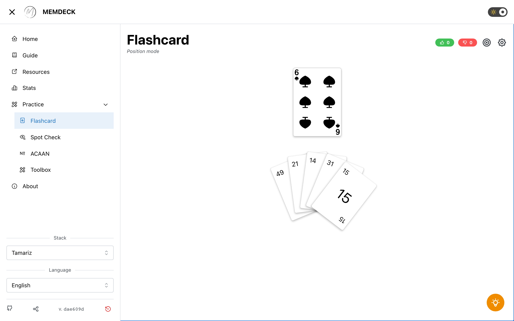

# MemDeck

[](https://github.com/julienroussel/memdeck.org/actions/workflows/CI.yml)
[](https://github.com/julienroussel/memdeck.org/actions/workflows/deploy.yml)
[](LICENSE)

A free, open-source training tool for mastering memorized deck systems. Built for magicians and memory enthusiasts.

**[Try it live →](https://memdeck.org)**



## Features

### Flashcard Trainer

Test your recall with three training modes:

- **Card → Position** — See a card, guess its position in the stack
- **Position → Card** — See a position, pick the correct card
- **Mixed** — Randomly alternates between the two

Each mode presents five choices and tracks your score in real time. An optional timer adds time pressure (5s–60s).

### ACAAN Calculator

Practice Any Card At Any Number calculations: a target card and position are shown, you calculate the required cut depth and get instant feedback.

### Interactive Card Spread

Browse any stack with a draggable, touch-friendly spread. Supports mouse, touch gestures, and keyboard navigation.

### Install as App

MemDeck is a Progressive Web App — install it on your phone or desktop for offline access.

### Multi-language

Available in English, French, Spanish, German, Italian, Dutch, and Portuguese.

### Dark / Light Mode

Toggle themes freely. Your preference is saved across sessions.

## Supported Stacks

| Stack | Author |
|-------|--------|
| Mnemonica | Juan Tamariz |
| Aronson | Simon Aronson |
| Memorandum | Woody Aragon |
| Redford | Patrick Redford |
| Particle | Joshua Jay |

## Getting Started

```sh
git clone https://github.com/julienroussel/memdeck.org
cd memdeck.org
pnpm install
pnpm run dev
```

<details>
<summary><strong>Development commands</strong></summary>

```bash
pnpm run lint          # Check formatting and lint rules (Biome)
pnpm run typecheck     # Type checking
pnpm run test          # Unit tests (Vitest)
pnpm run test:e2e      # E2E tests (Playwright)
pnpm run validate      # Full validation (knip + lint + typecheck + fta)
pnpm run build         # Production build
```

</details>

## Tech Stack

React 19 · TypeScript · Mantine · Vite · Vitest · Playwright · Biome

Runs entirely client-side with no backend. State is persisted in localStorage.

## Contributing

Want to help? Ideas for contributions:

- Add a new memorized deck system
- Improve translations or add a new language
- Report bugs or suggest features via [issues](https://github.com/julienroussel/memdeck.org/issues)

## License

[GPL-3.0](LICENSE)

## Acknowledgements

Card SVG images from [tekeye.uk](https://tekeye.uk/playing_cards/svg-playing-cards).
